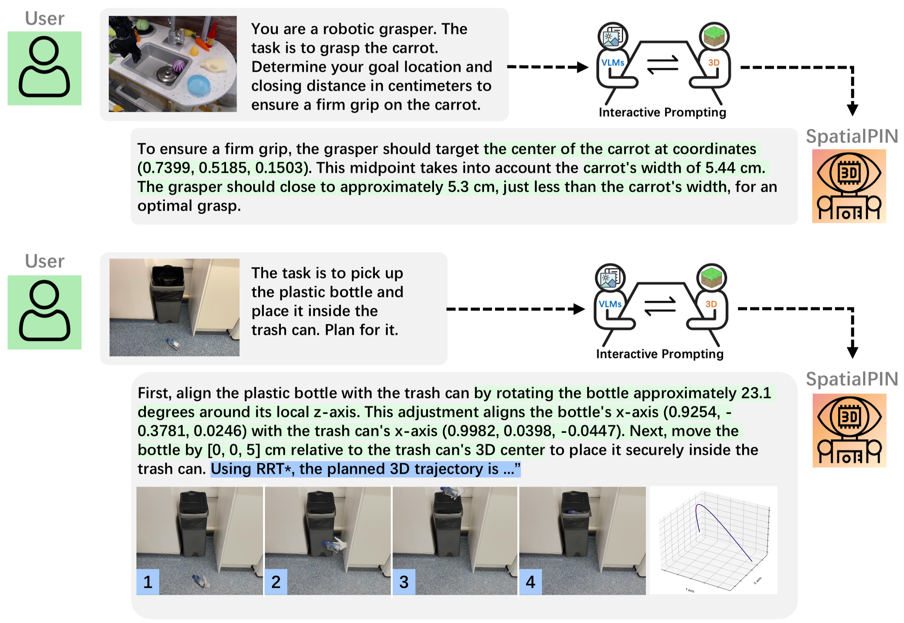

# SpatialPIN: Enhancing Spatial Reasoning Capabilities of Vision-Language Models through Prompting and Interacting 3D Priors
This is the implementation for the NeurIPS 2024 [paper](https://arxiv.org/abs/2403.13438). We release the code for our most complex application: Discovering and Planning for Robotics Tasks from a Single Image. For more information, please check the [project webpage](https://dannymcy.github.io/zeroshot_task_hallucination/).

This code implementation is of the first version of our [paper](https://arxiv.org/abs/2403.13438v3), so there are some implementation discrepancies, but the functionality remains the same!



## Environment Setup
> Note: This code was developed on Ubuntu 20.04 with CUDA 11.8. The implementation of SpatialPIN depends on two seperate Github repos.

Clone the repo.
```
git clone --recurse-submodules https://github.com/dannymcy/zeroshot_task_hallucination_code.git
cd zeroshot_task_hallucination_code
```
Set up separate Python environments.
For SpatialPIN main code: 
```
cd spatialpin
conda env create -f conda_env.yaml
conda activate /your_dir/spatialpin/env
```
For LaMa image inpainting:
```
cd ..
cd lama
conda env create -f conda_env.yaml
conda activate /your_dir/lama/env
```
For both, install CUDA and PyTorch appropriate versions for your system. For example:
```
pip install --no-cache-dir torch==2.1.1+cu118 -f https://download.pytorch.org/whl/torch_stable.html
pip install --no-cache-dir torchvision --extra-index-url https://download.pytorch.org/whl/cu118
```

### Prerequisites 
Prepare ```GPT API``` from [here](https://platform.openai.com/docs/api-reference/introduction) and put it in ```.../spatialpin/main/gpt_4/query.py``` line 7.

Open a public GitHub repo and put your Git token and repo name in ```.../spatialpin/main/process_3d.py``` line 476 and 477 (Github repo name is of format ```git_account_name/repo_name```).

Prepare ```One-2-3-45++ API``` for single-view object reconstruction from [here](https://www.sudo.ai/account) and put it in ```.../spatialpin/main/process_3d.py``` line 478.

Download Segment Anything backbone by running ```.../spatialpin/main/download_sam.py```


### Inference: Step 1  
Put the images containing multiple objects into  ```.../spatialpin/test_data/Real/dir_name/scene_<integer>/<integer>_color.png```. Each image should be in its own folder.
Update ```.../spatialpin/test_data/Real/test_list_subset.txt``` using the example format.

Navigate to the spatialpin folder:
```
sh ./runner.sh main/process_2d.py
```
This step will output inpainting masks for each identified object.


### Inference: Step 2
Navigate to the lama folder:
```
export TORCH_HOME=$(pwd) && export PYTHONPATH=$(pwd)
python bin/predict_obj.py
python bin/predict_bg.py
```
This step will output inpainted masks for each object and the inpainted background.


### Inference: Step 3
Navigate to the spatialpin folder:
```
sh ./runner.sh main/process_3d.py
```
This step will generate the discovered robotic tasks and 3D models of each object.


### Inference: Step 4
Navigate to the spatialpin folder:
```
blenderproc run main/render_animate.py
```
This step will generate the planned robotic task trajectories and render them as videos.

For information that tests the spatial reasoning capabilities of VLMs, refer to ```.../spatialpin/main/render_animate.py``` line 926.


### Citation
```
@inproceedings{ma2024spatialpin,
  title={SpatialPIN: Enhancing Spatial Reasoning Capabilities of Vision-Language Models through Prompting and Interacting 3D Priors},
  author={Ma, Chenyang and Lu, Kai and Cheng, Ta-Ying and Trigoni, Niki and Markham, Andrew},
  booktitle={Proceedings of the Conference on Neural Information Processing Systems (NeurIPS)},
  year={2024}
}
```

### Related Repos
We adapted some code from other repos in data processing, implementation, evaluation, etc. Please check these useful repos. 
```
https://github.com/zubair-irshad/shapo
https://github.com/advimman/lama
https://github.com/luca-medeiros/lang-segment-anything
https://github.com/PKU-YuanGroup/Video-LLaVA